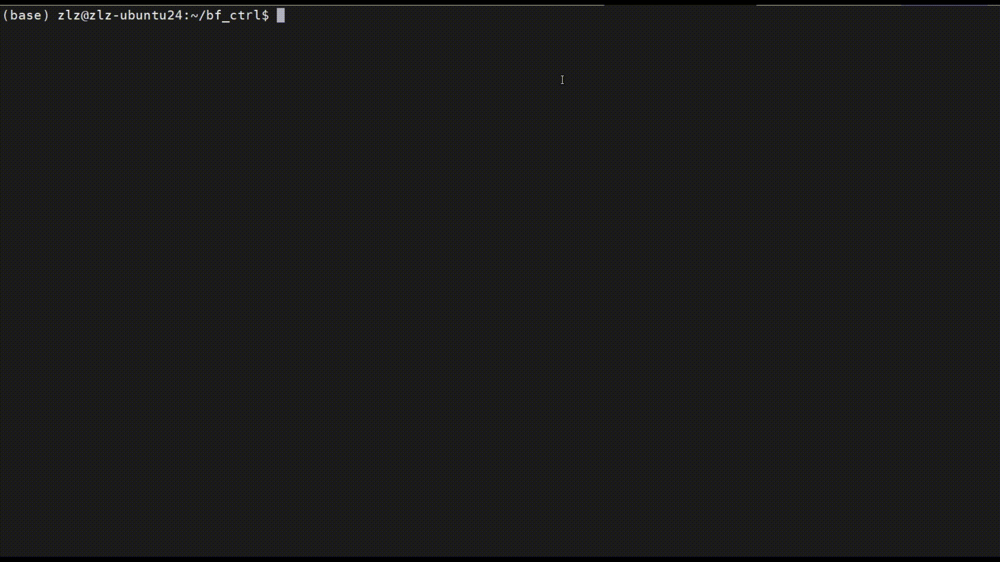

# ccolcon

Interactive terminal tool for compiling ROS2 workspaces, similar to ccmake.

## Overview

`ccolcon` is an interactive terminal user interface (TUI) tool designed to simplify the process of building ROS2 workspaces. It provides a visual interface for configuring build options and selecting packages to compile, making the ROS2 build process more intuitive and user-friendly.

## Installation

```bash
pip install -e .
```

## Usage

### Basic Usage
```bash
cd /path/to/your/ros2/workspace
ccolcon build
```

### Advanced Usage
```bash
# Specify workspace path explicitly
ccolcon build --workspace /path/to/ros2/workspace

# Change log directory
ccolcon build --log-dir /custom/log/path

# Execute other colcon commands
ccolcon list
ccolcon info --packages-select my_package
ccolcon test
```

## Features

- **Interactive Terminal UI (TUI)**: User-friendly interface built with Textual for navigating build configurations
- **Build Options Configuration**: Easily configure common build options such as:
  - `symlink-install`: Enable symbolic link installation (default: true)
  - `install-base`: Set installation base directory (default: "install")
  - `merge-install`: Merge install space (default: false)
  - `continue-on-error`: Continue building on error (default: false)
  - `parallel-workers`: Number of parallel workers (default: 4)
- **Package Selection**: Selectively choose which packages to build using an interactive table view
- **Persistent Configuration**: Save and load build configurations to `.ccolcon` file
- **Automatic Build Logging**: Comprehensive logging of build processes with timestamps
- **Direct Command Execution**: Support for all standard colcon commands through the interface

## Supported Commands

- `build`: Interactive build interface (default for build command)
- `extension-points`: List extension points
- `extensions`: List extensions
- `graph`: Generate dependency graph
- `info`: Show package information
- `list`: List packages
- `metadata`: Manage metadata of packages
- `mixin`: Manage mixin predefined sets
- `test`: Run tests
- `test-result`: Show test results
- `version-check`: Check colcon version

## Requirements

- Python 3.8+
- textual >= 8.0.0
- colcon (ROS2 build tool)

## Configuration

The tool automatically saves your build configurations to a `.ccolcon` file in your workspace directory. This allows you to maintain consistent build settings across sessions.

## Screenshots



## Architecture

The project is organized into several modules:

- `cli.py`: Command-line interface entry point
- `app.py`: Main Textual application class
- `models/build_config.py`: Build configuration management
- `screens/build_options.py`: UI screen for configuring build options
- `screens/package_select.py`: UI screen for package selection
- `colcon/executor.py`: Handles execution of colcon commands and logging

## License

This project is licensed under Apache 2.0 License.
